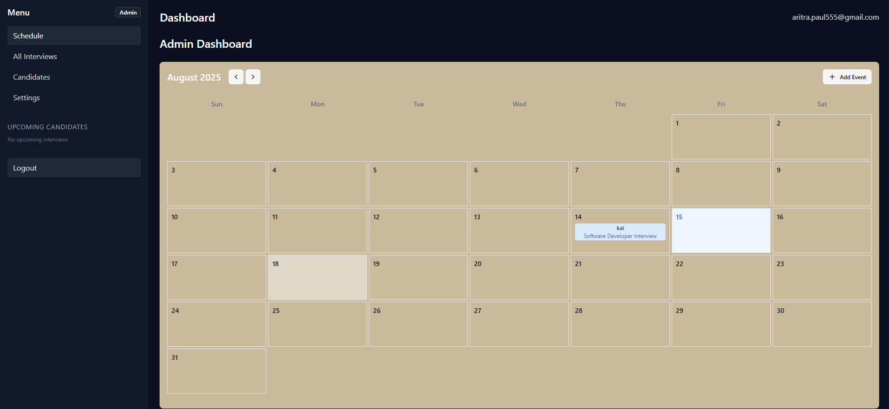

# 📅 Interview Scheduler with Calendar Sync

<p align="center">
  
  <br/>
  ** ADMIN DASHBOARD **
</p>

A **full-stack** application to streamline the interview scheduling process for recruiters and candidates.  
It provides:
- A drag-and-drop calendar interface  
- Google Calendar synchronization  
- Automated email reminders  
- Role-based access control  

---

## 🚀 Features

- **Drag-and-Drop Calendar Scheduling**  
  Easily create, move, and reschedule interviews using an interactive calendar UI.

- **Google Calendar Sync**  
  Automatically sync scheduled interviews to Google Calendar for both recruiters and candidates.

- **Email Reminders**  
  Send automated interview reminders to candidates and recruiters.

- **Role-Based Access**  
  Separate dashboards and permissions for:
  - **Recruiters** → Create, manage, and assign interviews.
  - **Candidates** → View and confirm interview times.

- **Time Zone Support**  
  Automatically adjust interview times for different time zones.

---

## 🛠 Tech Stack

### **Frontend**
- **Next.js**
- **TypeScript**
- **Styled Components**
- **FullCalendar.js**
- **Tailwind CSS**

### **Backend**
- **Node.js** with **Express**
- **MongoDB**
- **Google Calendar API**
- **Nodemailer**

---

## 📂 Folder Structure (Example)

```plaintext
my-interview-scheduler/
│
├── public/                   # Static assets (images, icons, etc.)
│   ├── favicon.ico
│   ├── logo.png
│   └── ... 
│
├── src/                      # Main source folder
│   ├── app/                  # App Router (Next.js 13+)
│   │   ├── layout.tsx        # Root layout
│   │   ├── page.tsx          # Landing page
│   │   ├── dashboard/        # Dashboard for recruiters/candidates
│   │   │   ├── page.tsx
│   │   │   └── ...
│   │   ├── login/            # Login page
│   │   │   └── page.tsx
│   │   ├── api/              # Serverless API routes
│   │   │   ├── auth/
│   │   │   │   └── route.ts  # Auth endpoints
│   │   │   ├── events/
│   │   │   │   └── route.ts  # Calendar events API
│   │   │   └── ...
│   │   └── ...
│   │
│   ├── components/           # Reusable UI components
│   │   ├── Calendar.tsx
│   │   ├── Navbar.tsx
│   │   ├── Sidebar.tsx
│   │   └── ...
│   │
│   ├── hooks/                # Custom React hooks
│   │   ├── useAuth.ts
│   │   ├── useCalendar.ts
│   │   └── ...
│   │
│   ├── lib/                  # Utility functions & config
│   │   ├── googleCalendar.ts # Google Calendar API integration
│   │   ├── nodemailer.ts     # Email reminders
│   │   └── ...
│   │
│   ├── styles/               # Global & module styles
│   │   ├── globals.css
│   │   └── Calendar.module.css
│   │
│   └── types/                # TypeScript types & interfaces
│       ├── event.d.ts
│       └── user.d.ts
│
├── .env.local                # Environment variables
├── package.json
├── tsconfig.json
├── next.config.js
└── README.md


## .env file

GOOGLE_CLIENT_ID=your_google_client_id
GOOGLE_CLIENT_SECRET=your_google_client_secret
GOOGLE_REDIRECT_URI=your_redirect_url
EMAIL_SERVICE=your_email_service
EMAIL_USER=your_email
EMAIL_PASS=your_password
DATABASE_URL=your_database_url
JWT_SECRET=your_jwt_secret
